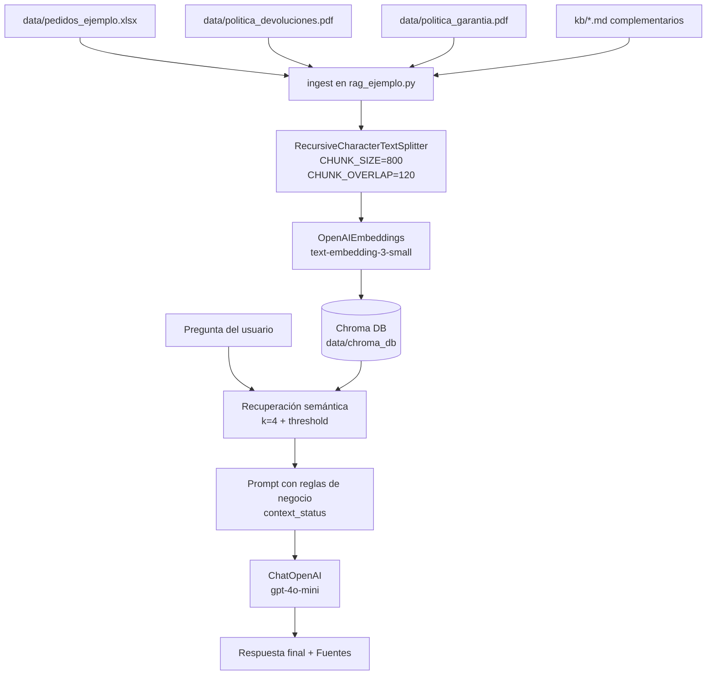

# Arquitectura del proyecto EcoMarket RAG

Este documento resume la estructura y arquitectura específica del proyecto `entregacuatro`.

## 1) Estructura principal del proyecto

```text
entregacuatro/
├─ data/
│  ├─ pedidos_ejemplo.xlsx
│  ├─ politica_devoluciones.pdf
│  ├─ politica_garantia.pdf
│  └─ settings-final.toml
├─ kb/
│  ├─ faq_general.md
│  ├─ pedidos.md
│  ├─ politica_devoluciones.md
│  ├─ politica_garantia.md
│  └─ kb_desde_toml.md
├─ scripts/
│  ├─ build_data_assets.py
│  └─ build_kb_from_json.py
├─ rag_ejemplo.py
├─ README.md
├─ Fase1.md
└─ Fase2.md
```

## 2) Arquitectura funcional (RAG)



## 3) Flujo operativo recomendado

1. Instalar dependencias: `pip install -r requirements.txt`
2. (Si aplica) migrar datos: `python scripts/build_data_assets.py`
3. Regenerar KB markdown: `python scripts/build_kb_from_json.py`
4. Indexar: `python rag_ejemplo.py ingest`
5. Consultar: `python rag_ejemplo.py ask -q "..."` o `python rag_ejemplo.py repl`

## 4) Puntos clave de diseño

- Se combinan fuentes estructuradas (Excel) y no estructuradas (PDF/Markdown).
- El chunking fijo con solapamiento equilibra precisión y contexto.
- La recuperación usa umbral de relevancia para evitar respuestas con contexto débil.
- Si no hay contexto confiable, el asistente informa límites y sugiere escalar a humano.
